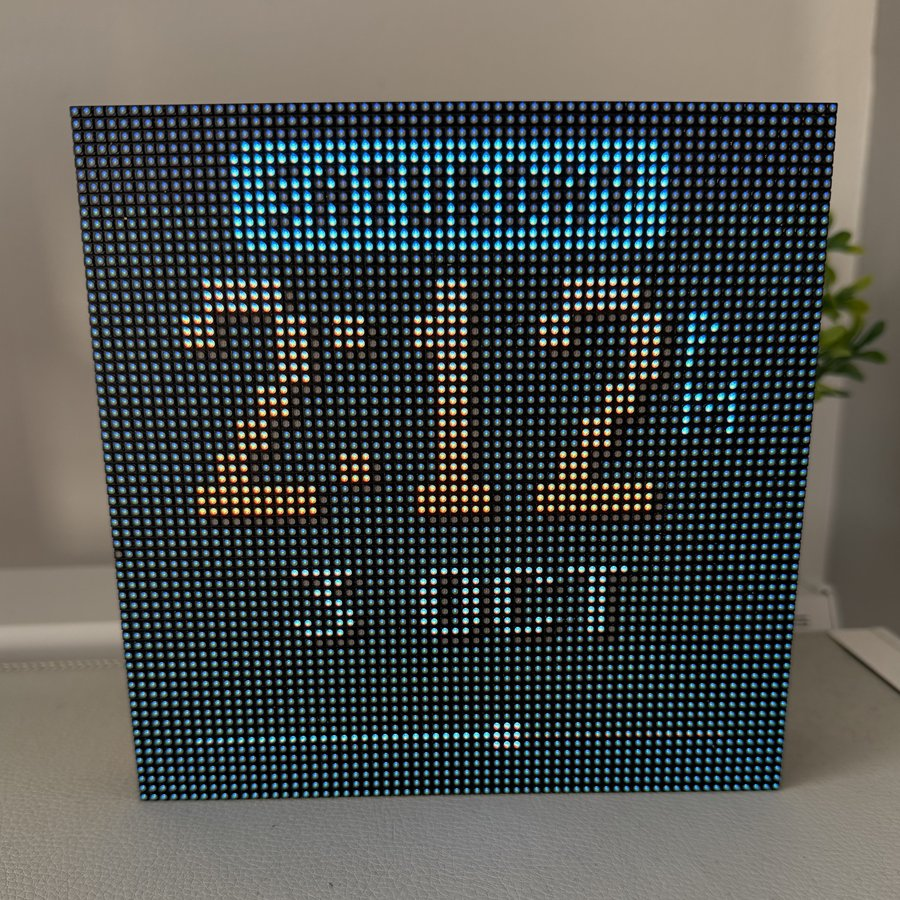
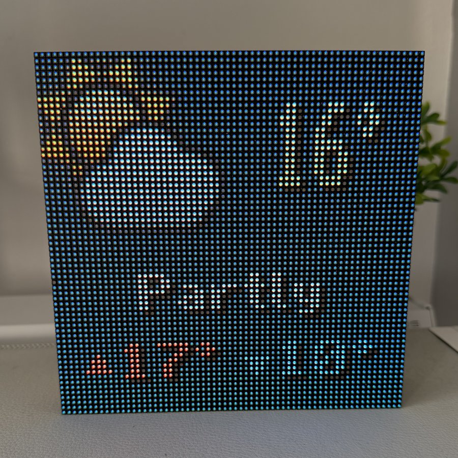
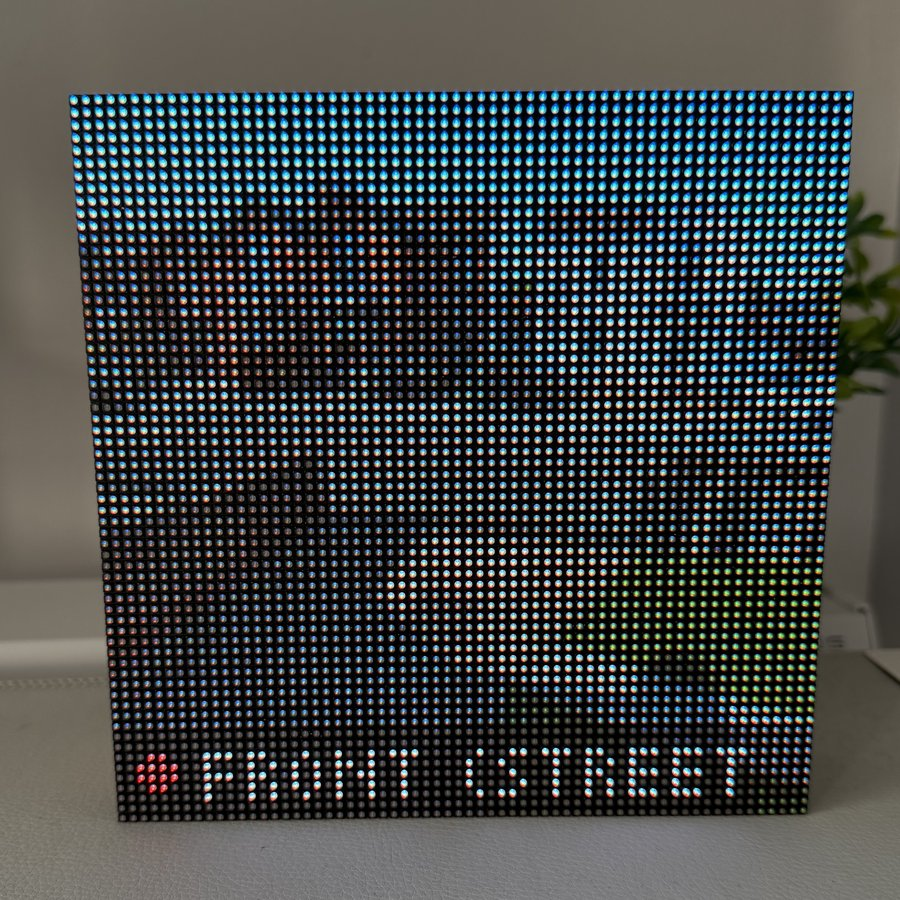
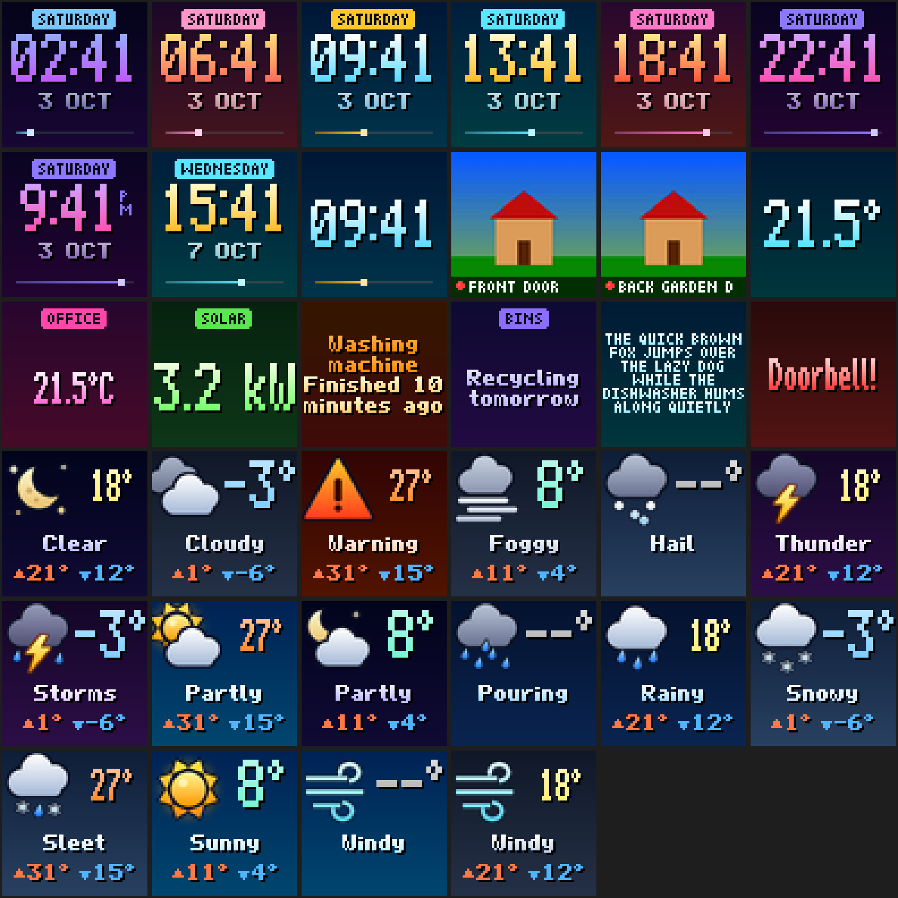

# Tuneshine for Home Assistant

A custom integration that puts Home Assistant on your [Tuneshine](https://tuneshine.rocks) when nothing is playing: a clock, the weather, a random camera, or anything you can write as a template. As soon as music starts, the album art takes over again.

| Clock | Weather | Random camera |
| :---: | :---: | :---: |
|  |  |  |

## How it works

The Tuneshine's local API lets you set a local idle image marked as *overridable*. Now-playing artwork from the Tuneshine cloud replaces it, and once playback goes idle the device puts it back by itself. This integration renders 64×64 frames with Pillow inside Home Assistant and pushes them over your LAN. It doesn't need a cloud account, and the device never has to reach Home Assistant.

- Pages rotate on a timer. The clock also refreshes on the minute.
- While music plays, nothing is pushed. When playback stops, a fresh page goes up straight away.
- Unchanged frames aren't re-sent.

## Install

1. In HACS, add `https://github.com/russmckendrick/ha-tuneshine` as a custom repository (category: Integration) and install **Tuneshine**. Or copy `custom_components/tuneshine` into your `config/custom_components` folder.
2. Restart Home Assistant.
3. The Tuneshine should be discovered automatically (`_tuneshine._tcp`). If it isn't, go to **Settings → Devices & services → Add integration → Tuneshine** and enter its IP address.
4. Open the integration's **Configure** dialog to choose your pages.

## Pages

| Page | Shows |
| --- | --- |
| Clock | Big time with a colour scheme that changes through the day, the weekday tag, the date and a day-progress bar. 12- or 24-hour. |
| Weather | A shaded icon for the condition, temperature coloured from icy blue to hot red, and today's high and low from the daily forecast. |
| Random camera | A snapshot from one of your chosen cameras (never the same one twice in a row), cropped and punched up for LEDs, with a name tag. **Show cameras every** (default 10 minutes) limits how often a snapshot is taken, which saves battery cameras like Ring doorbells being woken up; in between, the camera page is skipped. |
| Templates | One page per template, each with its own colour scheme. Split lines with `\|` or a newline. A short first line becomes a coloured heading tag. Short values are drawn big. |

Every page and weather condition, rendered by `scripts/preview.py`:



Template examples:

```jinja
Office|{{ states('sensor.office_temperature') | round(1) }}°
Solar|{{ (states('sensor.solar_power') | float(0) / 1000) | round(1) }} kW
Bins|{{ states('sensor.next_bin_collection') }}
```

## Entities

| Entity | What it does |
| --- | --- |
| `switch.*_home_assistant_idle_screen` | Turns the HA pages on or off. Off hands the screen back to the stock Tuneshine idle image. |
| `button.*_next_idle_page` | Skips to the next page. |
| `sensor.*_now_playing` | Current track, with artist, album, service and zone as attributes. |
| `image.*_artwork` | Current album art. |
| `number.*_active_brightness` / `*_idle_brightness` | Brightness for artwork and for idle images. |
| `sensor.*_idle_page`, `sensor.*_image_source` | Diagnostics. |

## Services

| Service | Use |
| --- | --- |
| `tuneshine.show_text` | Show a message for a while, over the artwork too, for example "Doorbell!". Takes `message`, `duration` and an optional `color`. |
| `tuneshine.show_image` | Show a camera snapshot (`camera_entity`) or an image from a `url` for a while. |
| `tuneshine.show_page` | Jump to a page: `clock`, `weather`, `camera`, `template` or `template_2` and so on. |
| `tuneshine.clear` | End a message or image early. |

All services take an optional `device_id`; without one they apply to every Tuneshine.

```yaml
automation:
  - alias: Doorbell on the Tuneshine
    triggers:
      - trigger: state
        entity_id: binary_sensor.doorbell
        to: "on"
    actions:
      - action: tuneshine.show_image
        data:
          camera_entity: camera.front_door
          duration: 30
```

## Notes

- After you stop music, the Tuneshine cloud can take a couple of minutes to mark playback idle (Apple Music took about 2.5 minutes in testing). The HA pages come back once it does.
- If Home Assistant stops, the last page stays on screen. Album art still overrides it.

## Development

```bash
uv venv --python 3.14 && uv pip install -r requirements_test.txt
.venv/bin/python -m pytest tests
python scripts/preview.py preview                       # render every page to PNGs
python scripts/preview.py preview --push                # and cycle them on a Tuneshine found over mDNS
python scripts/preview.py preview --push 192.168.1.50   # or on one at a given address
```
